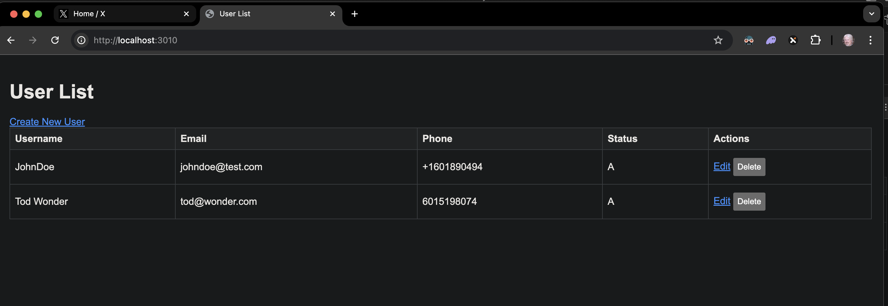

## Nodejs CRUD for DynamoDB (AWS)



## Project Setup

### Project Structure setup

```bash
mkdir dynamodb-crud-app
cd dynamodb-crud-app
npm init -y
npm install express aws-sdk ejs body-parser dotenv

# Create the basic file structure:

touch server.js
mkdir views
touch views/index.ejs views/create.ejs views/edit.ejs
mkdir public
touch public/style.css
touch .env

# Set up your .env file:

AWS_ACCESS_KEY_ID=your_access_key
AWS_SECRET_ACCESS_KEY=your_secret_key
AWS_REGION=your_region

# To clear a PID (Process ID):

lsof -i :3000
kill -9 3461

